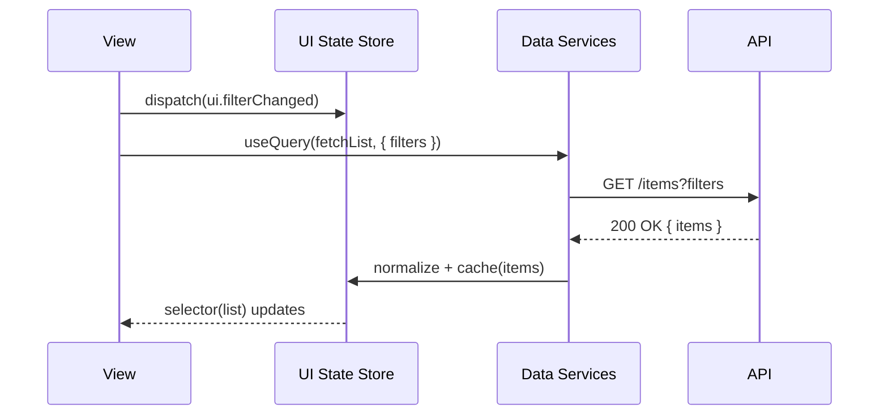

# Dashboard State Management Architecture

Date: 2026-03-26
Branch: feature/dashboard-state-architecture
Status: RFC Accepted

This brief proposes a layered, predictable state model for the Dashboard surface across web and API boundaries. It clarifies ownership, update flow, and testing seams.

## Layer overview

| Layer | Responsibility | Examples | Ownership |
|------|-----------------|----------|-----------|
| View (React) | Declarative rendering from derived state and URL | Components, hooks, route params | Web |
| UI State Store | In-memory client state and selectors | Zustand/Redux slices, derived selectors | Web |
| Data Services | Cache, fetch, and mutate backend data with consistency contracts | React Query wrappers, service modules | Web |
| API | Authoritative domain data and side effects | REST/GraphQL endpoints, transactions | API |

The guiding principle is single ownership per concern, explicit data flow, and testable boundaries.

## Goals

- Make dashboard behavior predictable by separating view concerns from data and side effects.
- Centralize cross-cutting logic (loading, errors, retries, normalization) in services, not components.
- Support optimistic UI where safe, with clear rollback rules.
- Enable targeted unit tests for selectors and services without mounting the whole app.
- Keep URL/route as a first-class input to state for shareability and deep-linking.

## Non-goals

- Replacing existing endpoints or data models in the API.
- Introducing a new global event bus beyond the store and service boundaries.
- Forcing a particular store library; patterns work with Zustand or Redux.

## Architecture

1. View (React)
   - Pure components consume selectors and mutations via hooks.
   - URL state (route params, query) is parsed and mapped to store inputs.
   - Components do not call fetch/mutate directly; they call service hooks.

2. UI State Store
   - Holds ephemeral UI state (selection, filters, pagination), plus normalized references to data fetched by services.
   - Exposes selectors that derive view-ready shapes from base state and cached data.
   - Enforces immutability or transactional updates per the chosen library’s conventions.

3. Data Services
   - Own fetching/mutation, cache lifecycle, invalidation, and optimistic updates.
   - Integrate with React Query (or equivalent) for request deduplication and retries.
   - Translate API wire shapes into normalized cache entries consumed by selectors.

4. API
   - Remains the source of truth for domain data and invariants.
   - Provides endpoints with idempotency where feasible to simplify retries.

## Update flow

- User interactions update UI store first (e.g., filters, sort), keeping the view responsive.
- Data services react to store/URL inputs and fetch as needed, reconciling with cache.
- Selectors stitch UI state and cached data into view models.

## Optimistic updates

- Mutations may apply optimistic patches to the cache if:
  - The API operation is idempotent or reversible.
  - Conflicts are rare or resolved deterministically.
- Rollback rules must be encoded next to the optimistic patch and covered by tests.
- Show inline error affordances and allow retry if server rejects the mutation.

## Consistency and invalidation

- Services define query keys that encode all inputs required to compute a dataset.
- After a successful mutation, invalidate or patch only affected keys.
- Prefer structural sharing in normalized caches to avoid re-renders.
- Selectors must be pure and memoized per input to bound recomputation.

## Error handling

- Centralize error classification (transport vs. domain) in services.
- Expose typed error states to the view so components can render precise affordances.
- Apply exponential backoff for transient failures; surface final failure with actionable copy.

## Testing strategy

- Store
  - Unit test reducers/actions (Redux) or mutators (Zustand) and selectors with fixed inputs.
  - Snapshot derived shapes to catch regressions in mapping logic.
- Services
  - Unit test fetch/mutate wrappers with mocked API responses, including optimistic/rollback paths.
  - Verify cache keys, invalidation, and normalization.
- Integration
  - Mount component-with-provider in tests to verify view reacts to selector changes without hitting the real network.

## URL as state

- The URL is a first-class input; parse it in a single place and write back via a thin router adapter.
- Don’t duplicate URL-derived state in the store; derive selectors from a canonical router snapshot.
- Use replace vs. push semantics to keep history meaningful.

## Migration plan

Phase 1: Introduce service layer and selectors alongside existing components
- Add read-only queries and selectors for the heaviest Dashboard modules.
- Keep existing component fetches but start routing new reads through services.

Phase 2: Move mutations and optimistic flows into services
- Replace imperative fetch calls in components with service hooks.
- Add rollback tests for each optimistic case.

Phase 3: Consolidate UI state into the store
- Move ad-hoc component state (filters, sorting, pagination) into a shared slice.
- Add memoized selectors for view models.

Phase 4: Remove legacy fetch/derive code from components
- Components consume selectors + service hooks only.
- Delete duplicate transformations and glue.

## Performance considerations

- Co-locate selectors with slices for minimal dependency footprints.
- Batch state updates in store to reduce render churn.
- Prefer incremental normalization over whole-list replacement to maximize structural sharing.
- Use windowing/virtualization for large lists; selectors should expose counts separate from items.

## Security and privacy

- Avoid storing sensitive data in long-lived caches; prefer short TTLs or memory-only caches.
- Redact or avoid logging PII in error paths; centralize redaction in service utilities.

## Alternatives considered

- Global event bus: rejected due to implicit coupling and test complexity.
- Component-local fetch with context providers: rejected due to duplicated logic and weak caching.
- Server-only rendering: rejected for interactive dashboard needs and offline support.

## Open questions

- Should we adopt entity adapters for normalization or keep a minimal hand-rolled index?
- What is the exact boundary between service cache and store slices to avoid duplication?
- Which dashboard modules are candidates for optimistic updates vs. pessimistic?

## Status and rollout

- Status: Accepted for the Dashboard surface; implementation underway in branches under feature/dashboard-state-architecture.
- Success criteria: reduced re-render count, faster perceived load, higher test coverage on selectors and services, and fewer user-visible inconsistencies after mutations.
