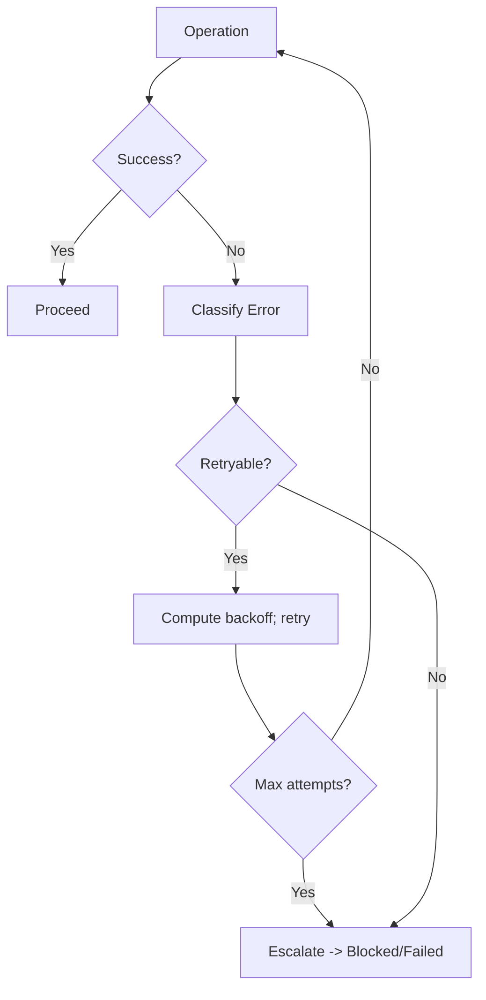

# Error and Retry Flow

Common Failures
- Tool call errors: file not found, string not found for edit, command failures, timeouts.
- Planning/Execution timeouts or exceeded budgets.
- Non-deterministic checks or flaky tests.

Retry Strategy
- Classify errors: retryable (transient) vs non-retryable (logic/validation).
- Use bounded retries with exponential backoff and jitter for retryable errors.
- Preserve idempotence: deduplicate by event_id where applicable.

Escalation
- On persistent failure: surface diagnostics, propose fallback, or request clarification.
- Pause for questions when requirements are ambiguous or conflicting.
- Transition to Blocked when external dependency is unavailable; await external_signal.

Diagram

Operational Notes
- Always capture minimal, relevant error excerpts (avoid dumping huge logs).
- Cancel timers when leaving states; ensure no orphaned retries.
- Record metrics: attempts, error classes, backoff, resolution.

## Error taxonomy
| Class | Examples | Retry? | Policy |
|------|----------|--------|--------|
| Transient | timeouts, rate limits, network flakiness | Yes | Exponential backoff + jitter |
| Resource | out-of-memory, disk full, quota exceeded | Maybe | One retry after mitigation; otherwise escalate |
| Tool Misuse | edit string not found, wrong path | No | Fix logic; do not retry blindly |
| Validation | schema mismatch, tests fail deterministically | No | Fix implementation/tests |
| External Dependency | downstream unavailable | Yes | Backoff with max; transition to Blocked if persists |

## Retry policy
- Bounded attempts (e.g., 3-5) for retryable classes.
- Reset attempt counter when error class changes.
- Capture and surface the command/context for each attempt.

## Backoff & jitter
- Exponential backoff: base * 2^attempt (e.g., base=2s: 2,4,8,16...)
- Add jitter to avoid thundering herd: random +/- 20% or full jitter.
- Cap maximum backoff (e.g., 60s) and total time budget per state.
- Example formula:
  - delay = min(max_delay, base * 2^n) * (1 - 0.2 + rand(0, 0.4))

## Max attempts & escalation
- After max attempts, transition to Blocked (if external) or Failed (if internal).
- Surface a concise incident summary: error class, attempts, backoff schedule, next actions.
- Ask clarifying questions when ambiguity is the root cause.

## Observability & metrics
- Emit counters: retries_total{class}, failures_total{class}, escalations_total.
- Timers: time_to_resolution, backoff_delay.
- Logs: structured context with correlation_id and attempt.

## Examples
- Command timeout:
  - Class: Transient; attempts: up to 3; backoff: 2s,4s,8s; jitter +-20%.
- Edit string not found:
  - Class: Tool Misuse; no retry; read the file again, adjust anchor, then attempt once.

## Related flows
- Planning State Machine: ../flows/planning_state_machine.md
- Implement Flow: ../flows/implement_flow.md
- Tool Call Lifecycle & Guardrails: ../flows/tool_call_lifecycle.md
