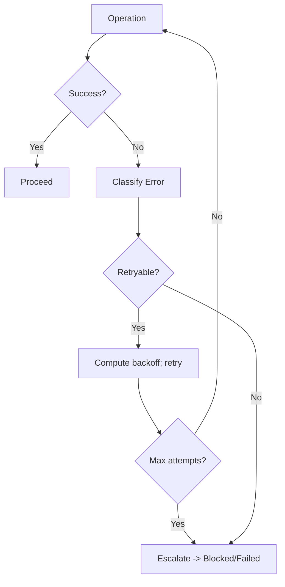

# Error and Retry Flow

Common Failures
- Tool call errors: file not found, string not found for edit, command failures, timeouts.
- Planning/Execution timeouts or exceeded budgets.
- Non-deterministic checks or flaky tests.

Retry Strategy
- Classify errors: retryable (transient) vs non-retryable (logic/validation).
- Use bounded retries with exponential backoff and jitter for retryable errors.
- Preserve idempotence: deduplicate by event_id where applicable.

Escalation
- On persistent failure: surface diagnostics, propose fallback, or request clarification.
- Pause for questions when requirements are ambiguous or conflicting.
- Transition to Blocked when external dependency is unavailable; await external_signal.

Diagram

Operational Notes
- Always capture minimal, relevant error excerpts (avoid dumping huge logs).
- Cancel timers when leaving states; ensure no orphaned retries.
- Record metrics: attempts, error classes, backoff, resolution.
