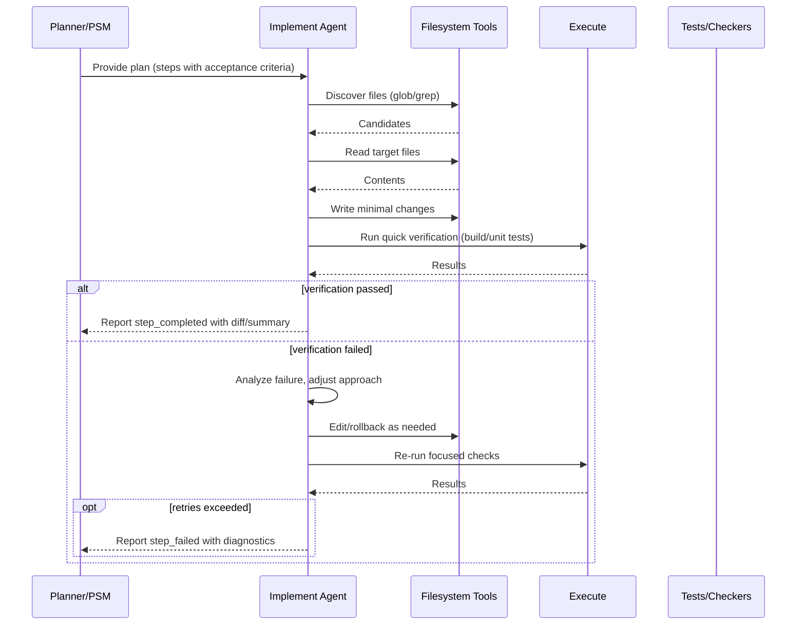

# Implement Flow

Overview
- Describes how the implement agent executes planned steps, runs verification commands, and iterates until completion or escalation.

Responsibilities
- Apply minimal, targeted edits.
- Use repository tools safely (grep/glob/read/edit/execute) with guardrails.
- Verify after each change (build/tests/lints) and rollback or iterate if needed.
- Surface diffs and rationale for reviewers.

Sequence

Verification
- Prefer fast checks first: type check, lint, unit tests for touched modules.
- Run broader tests only when necessary; avoid full repo sweeps when a subset suffices.
- Capture stdout/stderr artifacts concisely; link to detailed logs only when needed.

Failure handling
- Use bounded retries with backoff from the PSM.
- On persistent failure, provide actionable diagnostics: failing command, key error excerpts, suspected root cause, next steps.
- Never leave the repo in a broken state mid-step; keep changes cohesive per commit/patch.

## Preconditions
- A concrete plan exists with ordered steps and acceptance criteria (from the Planning State Machine).
- Repository is in a clean state; necessary dependencies/tools are available.
- Tooling guardrails are understood (see: ../flows/tool_call_lifecycle.md).

## Inputs
- Plan steps with rationale and acceptance criteria.
- Repository context (files, configuration, tests).
- Constraints: time budget, retry policy, and resource limits.

## Outputs & Artifacts
- Minimal diffs implementing the step.
- Verification outputs: key excerpts from build/test/lint runs.
- A step result summary including what changed, why, and links to related docs/tests.

## Detailed steps
- Discover targets using glob/grep; avoid blind edits.
- Read candidate files and locate precise anchors.
- Draft the smallest viable change; prefer focused patches.
- Apply edits atomically (use multi_edit for repeated patterns).
- Run fast checks first; expand scope only if needed.
- Iterate: refine edits based on failures until criteria pass or limits hit.
- Report step_completed with diff summary and verification evidence.

## Verification strategy
- Start local/fast: type checks, lints, and unit tests focused on touched modules.
- Escalate to broader or integration tests only when behavior crosses boundaries.
- Keep logs concise; include commands run, and short failure excerpts.
- Reproduce failures deterministically before attempting fixes.

## Failure handling
- Use bounded retries with backoff for transient issues (see: ../flows/error_and_retry_flow.md).
- For non-retryable or ambiguous failures, pause and escalate with diagnostics and questions.
- Never leave partial, breaking changes; rollback or adjust within the same step.

## Examples
- Add a function with tests:
  - Edit target module; add function and docstring.
  - Add/adjust unit tests covering success and error paths.
  - Run lints, type checks, tests for the package; include snippets of output.
- Update a CLI command:
  - Locate command definition; update parsing and help text.
  - Add test for new flag; run affected integration tests.

## Related flows
- Planning State Machine: ../flows/planning_state_machine.md
- Review & Test Flow: ../flows/review_and_test_flow.md
- Tool Call Lifecycle & Guardrails: ../flows/tool_call_lifecycle.md
- Error & Retry Flow: ../flows/error_and_retry_flow.md
