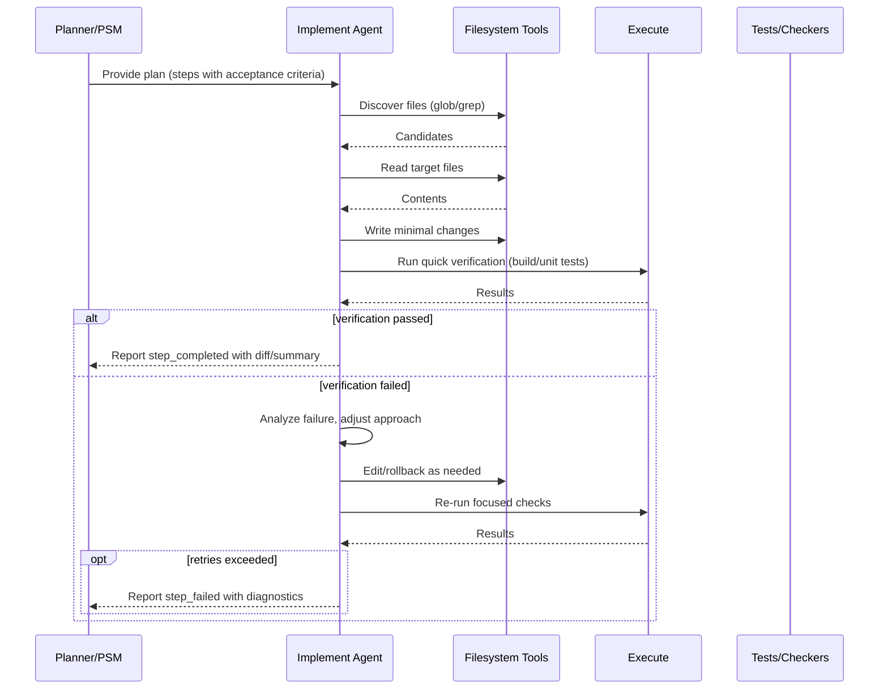

# Implement Flow

Overview
- Describes how the implement agent executes planned steps, runs verification commands, and iterates until completion or escalation.

Responsibilities
- Apply minimal, targeted edits.
- Use repository tools safely (grep/glob/read/edit/execute) with guardrails.
- Verify after each change (build/tests/lints) and rollback or iterate if needed.
- Surface diffs and rationale for reviewers.

Sequence

Verification
- Prefer fast checks first: type check, lint, unit tests for touched modules.
- Run broader tests only when necessary; avoid full repo sweeps when a subset suffices.
- Capture stdout/stderr artifacts concisely; link to detailed logs only when needed.

Failure handling
- Use bounded retries with backoff from the PSM.
- On persistent failure, provide actionable diagnostics: failing command, key error excerpts, suspected root cause, next steps.
- Never leave the repo in a broken state mid-step; keep changes cohesive per commit/patch.
