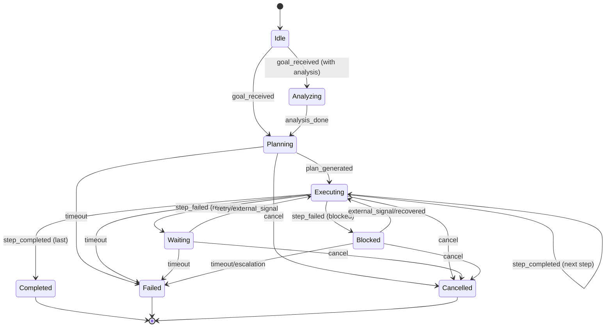

# Planning State Machine

Purpose
- Define how the agent converts a high-level goal into an actionable plan and drives it to execution with clear states, transitions, and side effects.

Scope
- Internal engineering view: states, events, transitions, entry/exit actions, idempotence, and observability.

Cross-links
- Index: ../README.md
- Related test plan: ../test_plan_planning_state_machine.md

States
- Idle: waiting for goal
- Analyzing: optional pre-planning analysis
- Planning: generating plan
- Executing: plan being executed (handoff to implement flow)
- Waiting: paused/backoff/external-signal
- Blocked: dependency unavailable or non-retryable precondition
- Failed: terminal failure
- Completed: terminal success
- Cancelled: terminal cancellation

Transitions (high level)
- Idle + goal_received -> Planning/Analyzing
- Analyzing + analysis_done -> Planning
- Planning + plan_generated -> Executing
- Executing + step_completed[last] -> Completed
- Executing + step_failed[retryable] -> Waiting
- Waiting + retry/external_signal -> Executing/Planning
- Any non-terminal + cancel -> Cancelled
- Planning/Executing/Waiting + timeout -> Failed/Blocked per policy

Entry/Exit actions
- On enter Planning: persist(goal), start planner, schedule planning_timeout
- On plan_generated: persist(plan), cancel planning_timeout
- On enter Executing: start execution for step_i, schedule execution_timeout
- On step_completed: update progress, emit metrics
- On step_failed: compute backoff, schedule retry, emit metrics
- On cancel: cleanup, emit metrics

Diagram

Edge cases
- Duplicate events: must be idempotent (use event_id deduplication) and not change state twice.
- Out-of-order events: reject or buffer per policy; document precedence.
- Race: cancel vs completion — define precedence explicitly; ensure no leaked timers.
- Persistence: snapshot contains enough to reconstruct timers and step index; restore maintains invariants.

Observability
- Emit structured logs/metrics on every transition: state_from, state_to, event_type, correlation_id, attempt, timestamps.
- Trace tool calls and timers with causal links to state transitions.

## States
- Idle, Analyzing, Planning, Executing, Waiting, Blocked, Failed, Completed, Cancelled.
- Each state defines entry actions, timers, and allowed events.

## Transitions
- Explicit guards for each transition; reject illegal transitions with logs.
- Idempotent handling of duplicate events via event_id deduplication.

## Timeouts & budgets
- Planning timeout (e.g., 60s) and execution timeout per step (configurable).
- Global budget per goal; on exceed, escalate with partial progress.
- Backoff timers scheduled in Waiting; cancel on exit.

## Must-ask rule
- If any input, constraint, or acceptance criterion is ambiguous, ask before acting.
- Examples:
  - Conflicting requirements (e.g., "add flag" vs "no CLI changes").
  - Missing environment details needed to run tests or builds.
  - Unclear priority when scope is too large for the budget.
- Batch questions to minimize round trips; propose defaults to accelerate.

## Batching questions
- Group related clarifications; order by impact on downstream work.
- Provide proposed assumptions and request confirmation.
- Include how answers will change the plan to show value.

## Related flows
- Implement Flow: ../flows/implement_flow.md
- Review & Test Flow: ../flows/review_and_test_flow.md
- Error & Retry Flow: ../flows/error_and_retry_flow.md
- Tool Call Lifecycle & Guardrails: ../flows/tool_call_lifecycle.md
