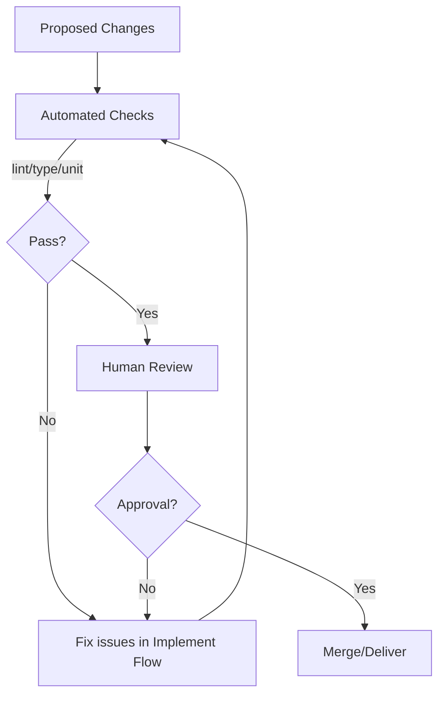

# Review and Test Flow

Review
- Ensure changes meet the goal, follow style, and are minimal yet sufficient.
- Check diffs for correctness, naming consistency, and documentation updates.

Tests
- Strategy: prioritize unit tests for new/changed logic; add/adjust integration tests where behavior crosses boundaries.
- Determinism: avoid flakiness; use fakes/mocks and controlled clocks.
- Coverage: target meaningful branch/behavior coverage rather than raw percent.

Criteria
- All CI checks pass (lint/type/test/build as applicable).
- New behavior is covered by tests; failures reproduce locally.
- Docs updated (including flow docs when processes change).

Diagram

## Review checklist
- Scope: changes are minimal yet sufficient; no unnecessary churn.
- Correctness: logic, edge cases, and error handling are sound.
- Style: naming, structure, and formatting follow conventions.
- Tests: new behavior is covered; tests are clear and deterministic.
- Docs: updated where relevant (README, flow docs, inline comments).
- Security: no secrets in code/logs; inputs validated; least privilege in scripts.

## Test strategy details
- Unit tests
  - Cover pure functions and small modules with fast, deterministic tests.
  - Use parameterized tests for boundary conditions and branches.
- Integration tests
  - Exercise interactions across modules/tools; use fakes/mocks for external systems.
  - Keep runtime bounded; mark slow tests and run selectively locally.
- Golden tests
  - When using snapshots, keep them small and stable; document update procedure.
- Tooling
  - Use consistent commands for local vs CI (e.g., npm/pnpm test, pytest, etc.).

## Determinism & flakiness
- Avoid real-time and randomness in tests; inject clocks and RNG seeds.
- Control environment variables and filesystem state within tests.
- Isolate network calls; record/replay or fake them.
- Quarantine known flaky tests; fix or remove before merge.

## Coverage targets
- Aim for meaningful branch and behavior coverage in changed areas.
- New modules: ~80%+ line coverage with focus on critical paths.
- Do not chase global percent; ensure assertions cover intent and failure modes.

## Examples
- Adding input validation:
  - Unit tests for valid/invalid inputs with expected messages.
  - Integration test to verify error propagation to CLI/HTTP layer.
- Refactoring a helper:
  - Characterize tests before; refactor; ensure tests still pass.

## Related flows
- Implement Flow: ../flows/implement_flow.md
- Planning State Machine: ../flows/planning_state_machine.md
- Error & Retry Flow: ../flows/error_and_retry_flow.md
- Tool Call Lifecycle & Guardrails: ../flows/tool_call_lifecycle.md
