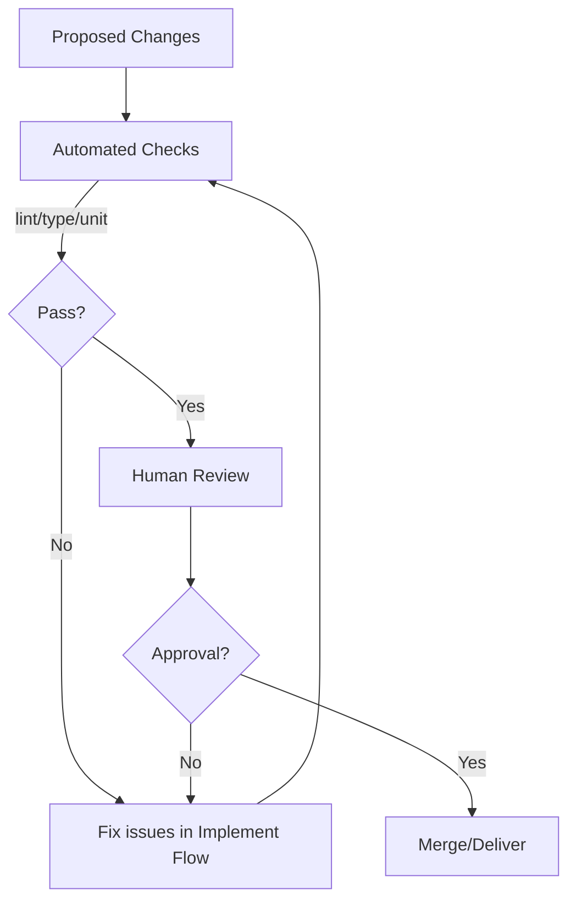

# Review and Test Flow

Review
- Ensure changes meet the goal, follow style, and are minimal yet sufficient.
- Check diffs for correctness, naming consistency, and documentation updates.

Tests
- Strategy: prioritize unit tests for new/changed logic; add/adjust integration tests where behavior crosses boundaries.
- Determinism: avoid flakiness; use fakes/mocks and controlled clocks.
- Coverage: target meaningful branch/behavior coverage rather than raw percent.

Criteria
- All CI checks pass (lint/type/test/build as applicable).
- New behavior is covered by tests; failures reproduce locally.
- Docs updated (including flow docs when processes change).

Diagram

