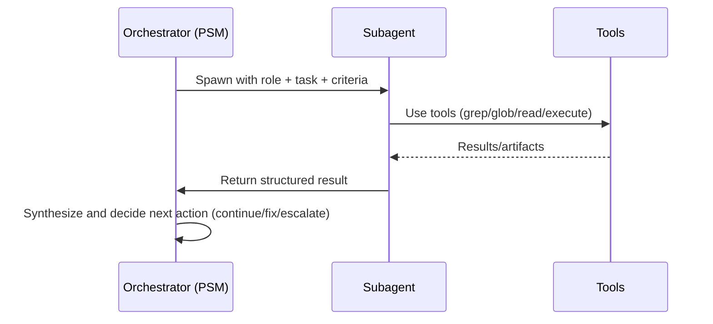

# Task Subagent Flow

When to use
- Spawn a subagent to handle an isolated, complex, or parallelizable task (e.g., deep search, large refactor chunk) where siloing context helps.
- Avoid for trivial actions or when you need interactive, step-by-step visibility.

Lifecycle
- Spawn: provide clear role, constraints, and expected output (structured result).
- Run: subagent executes autonomously; may use repo tools as needed.
- Return: one-shot result; orchestrator integrates and decides next step.

Inputs/Outputs
- Inputs: role, detailed task description, acceptance criteria.
- Outputs: concise structured result, artifacts/links if any, confidence and caveats.

Diagram



Isolation notes
- Subagent is ephemeral; no persistent state beyond its return payload.
- Keep payload sizes bounded; summarize large findings.
- Avoid leaking credentials or environment-specific details into prompts/results.

## Decision criteria
- Use a subagent when the task is:
  - Large/complex and benefits from isolated context.
  - Parallelizable and independent from other steps.
  - Likely to require heavy tool usage or long analysis.
- Avoid when the task is trivial, requires interactive back-and-forth, or tightly couples with orchestrator state.

## Prompt template
- Role: what the subagent is and is not responsible for.
- Task: explicit objective, inputs, constraints, and expected outputs.
- Guardrails: tools allowed, forbidden actions, time budget, and privacy rules.
- Example shell:
```
You are an autonomous subagent focused on <domain>.
Goal: <succinct objective>
Inputs: <links, files, context>
Constraints: <time budget, retries>
Tools: grep/glob/read/edit/execute only; no external network.
Deliver: JSON with {summary, artifacts, decisions, caveats}.
```

## Expected output schema
- JSON object with fields:
  - summary: string
  - findings: array of {path, snippet|link, note}
  - changes: array of {path, diff_summary}
  - tests: array of {command, outcome, key_output}
  - caveats: array of strings

## Security & privacy
- No secrets in prompts, logs, or artifacts.
- Redact or truncate sensitive file contents; include only necessary snippets.
- Enforce allowed tool list; disallow network calls by default.

## Timeouts & limits
- Default soft time budget per subagent invocation; enforce via orchestrator.
- Limit number/size of artifacts in the return payload.
- Fail fast on repeated tool errors; surface diagnostics and stop.

## Examples
- Deep code search:
  - Inputs: target API name; outputs: list of callsites with context.
- Module-level refactor:
  - Inputs: function signature change; outputs: edited files and passing unit tests.

## Related flows
- Planning State Machine: ../flows/planning_state_machine.md
- Implement Flow: ../flows/implement_flow.md
- Tool Call Lifecycle & Guardrails: ../flows/tool_call_lifecycle.md
- Error & Retry Flow: ../flows/error_and_retry_flow.md
