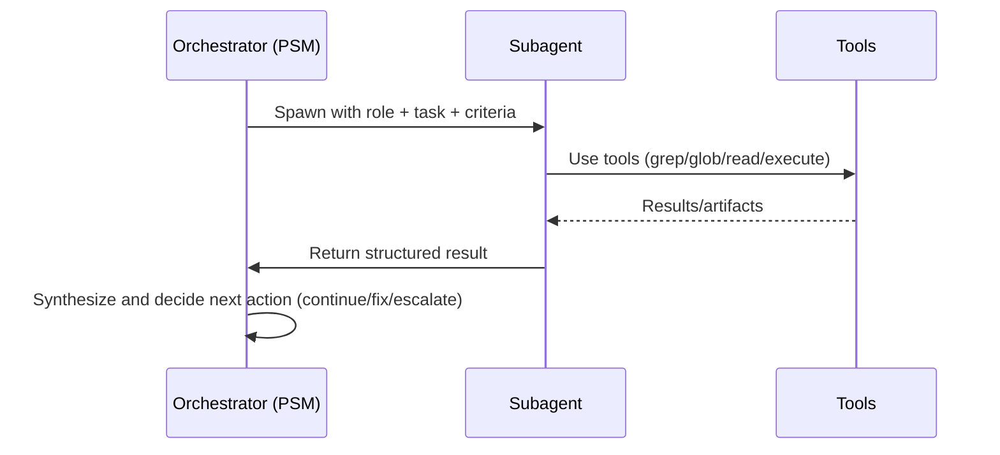

# Task Subagent Flow

When to use
- Spawn a subagent to handle an isolated, complex, or parallelizable task (e.g., deep search, large refactor chunk) where siloing context helps.
- Avoid for trivial actions or when you need interactive, step-by-step visibility.

Lifecycle
- Spawn: provide clear role, constraints, and expected output (structured result).
- Run: subagent executes autonomously; may use repo tools as needed.
- Return: one-shot result; orchestrator integrates and decides next step.

Inputs/Outputs
- Inputs: role, detailed task description, acceptance criteria.
- Outputs: concise structured result, artifacts/links if any, confidence and caveats.

Diagram

Isolation notes
- Subagent is ephemeral; no persistent state beyond its return payload.
- Keep payload sizes bounded; summarize large findings.
- Avoid leaking credentials or environment-specific details into prompts/results.
