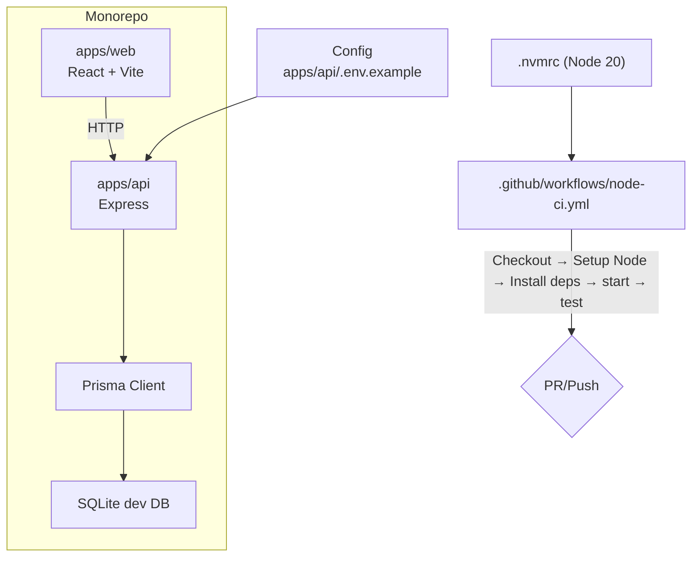

# Infrastructure Overview

This document explains how the monorepo is structured from an infrastructure perspective, how to run it locally, how CI is configured, and considerations for deployment and operations. It documents the current state; it does not introduce containerization or infrastructure-as-code.

## Architecture and App Topology

- apps/api: Node.js Express API using Prisma for data access.
- apps/web: React application bundled with Vite.
- Database (dev): SQLite database managed by Prisma. The datasource and URL are defined in apps/api/prisma/schema.prisma and apps/api/.env(.example).

## Environments and Configuration

Source of truth for API environment variables: apps/api/.env.example

Current variables listed there:
- JWT_SECRET: Secret used for signing/verifying JWTs (development example value only)
- DATABASE_URL: Prisma datasource URL. In development this is set to file:./dev.db (SQLite).
- PORT: Port for the API server (default example: 3001)

Web (Vite) environment variables:
- Vite only exposes variables prefixed with VITE_. If/when adding web-side env vars, ensure names start with VITE_.

Note: Keep this section in sync with apps/api/.env.example when variables change.

## Continuous Integration (CI)

Workflow: .github/workflows/node-ci.yml

Summary of steps:
- Checkout repository
- Setup Node using the version from .nvmrc (Node 20)
- Install dependencies (npm ci if package-lock.json exists, otherwise npm install)
- Run start script: npm run start
- Run tests: npm test

Node version: The repo includes .nvmrc specifying Node 20, which CI honors.

Package manager note: The repository has a pnpm-workspace.yaml, while CI uses npm. Follow per-package scripts locally using your preferred manager (npm/pnpm), but be consistent within a given workflow. Unifying package management is out of scope for this doc change.

## Local Development

Prerequisites:
- Node 20+ (per .nvmrc)
- Create API .env from apps/api/.env.example and adjust values as needed

Install dependencies:
- You may use npm or pnpm locally. Install at the workspace root if needed and/or per app.

API (apps/api):
- Dev server: from apps/api, run one of:
  - npm run dev (nodemon)
  - npm start
- Default port: 3001 (configurable via PORT)
- Prisma basics:
  - Generate client: npm run prisma:generate
  - Apply/migrate (interactive dev): npm run prisma:migrate
  - Push schema (no migrations): npm run prisma:push
  - Reset DB: npm run prisma:reset
  - Open Prisma Studio: npm run prisma:studio

Web (apps/web):
- Dev server: from apps/web, run:
  - npm run dev
- Default Vite dev server port: typically 5173 unless configured otherwise

## Database Operations with Prisma

Schema: apps/api/prisma/schema.prisma

- Datasource provider: sqlite
- DATABASE_URL from environment; in development, apps/api/.env.example sets file:./dev.db

Common commands (from apps/api):
- Generate client: npm run prisma:generate
- Create/apply dev migration: npm run prisma:migrate
- Push schema to DB without migrations: npm run prisma:push
- Reset database (drops and re-applies migrations): npm run prisma:reset

## Deployment Guidance (non-prescriptive)

This repository does not include containers or IaC. The following are options and considerations if you deploy these apps:

- API (Express):
  - Package as a Node service (e.g., systemd, PM2, container) and provide environment variables (JWT_SECRET, DATABASE_URL, PORT).
  - For production, replace SQLite with a managed database (e.g., Postgres) and update DATABASE_URL accordingly. Create and run Prisma migrations during deploy.
  - Ensure a process manager and health checks (HTTP /health endpoint if you add one) are in place. Configure graceful shutdown.

- Web (Vite/React):
  - For SPA hosting, build a static bundle (npm run build if/when a build script exists) and serve via a static host (CDN + object storage) or a web server.
  - Configure the API base URL via environment or configuration. For Vite, client-exposed vars must use VITE_ prefix.

- Networking & security:
  - Terminate TLS at your edge/load balancer.
  - Prefer private networking between web hosting and API (if server-side render/proxy) or CORS configuration for browser clients.

- CI/CD:
  - Extend the existing CI or add a dedicated CD workflow to build, test, and publish artifacts. Run Prisma migrations as part of release.

## Operations

- Logging: The API currently uses console logging. Consider structured logging and log shipping in production (e.g., to CloudWatch, ELK, or similar).
- Monitoring: Add metrics and health endpoints. Consider uptime monitoring and application APM.
- Backups: If using a production database, configure automated backups and tested restore procedures.

## Troubleshooting

- Node version issues: Ensure Node 20 per .nvmrc.
- Missing environment variables: copy apps/api/.env.example to apps/api/.env and set values.
- Prisma client errors: run npm run prisma:generate after schema changes and ensure DATABASE_URL is valid.
- SQLite file not created: ensure you are running commands from apps/api and that DATABASE_URL points to file:./dev.db.
- Port conflicts: Change PORT in the API .env or set a different Vite dev port if needed.

## References

- apps/api/.env.example
- apps/api/prisma/schema.prisma
- apps/api/package.json scripts
- apps/web/package.json scripts
- .github/workflows/node-ci.yml
- .nvmrc
- pnpm-workspace.yaml
